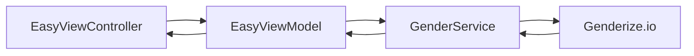

# network_swift

Небольшое iOS-приложение на UIKit: пользователь вводит имя, приложение запрашивает [Genderize.io](https://genderize.io/) и показывает предполагаемый пол. Репозиторий назван по теме — сетевой слой на Swift; Xcode-проект и таргет внутри называются **animation**.

## Как это работает

1. `EasyViewController` собирает экран: подпись, поле «Напиши имя...» и кнопку «Проверить».
2. По нажатию view model проверяет, что имя не пустое, и передаёт его в сервис.
3. `GenderService` выполняет `GET` через `URLSession`, декодирует JSON в `Person` и возвращает `Result`.
4. На главном потоке обновляется текст на экране: имя и пол или сообщение об ошибке.



Слои разделены явно: UI не знает про URL, сеть не знает про `UILabel`. Сервис описан протоколом `GenderServiceProtocol`, чтобы view model можно было подменить в тестах. Точка входа в UI — `SceneDelegate`: корневой `EasyViewController` внутри `UINavigationController`.

## Быстрый старт

1. Откройте `animation.xcodeproj` в Xcode.
2. Выберите схему **animation** и симулятор или устройство.
3. Запустите проект (⌘R).
4. Введите имя латиницей и нажмите «Проверить».

Нужны macOS с Xcode, iOS **26.0** (минимальная версия в проекте), Swift **5.0** и интернет на симуляторе или устройстве. Внешних зависимостей нет — только UIKit и Foundation.

## Внешний API

```http
GET https://api.genderize.io/?name=Alex
```

```json
{
  "name": "Alex",
  "gender": "male",
  "probability": 0.99,
  "count": 100000
}
```

В модели `Person` читаются `name` и `gender`. Поля `probability` и `count` в ответе есть, но в UI не используются. Если тело ответа пустое, сервис отдаёт `NetworkError.noData`.

## Файлы

| Файл | Назначение |
|------|------------|
| `EasyViewController.swift` | Вёрстка, действия пользователя, привязка к view model |
| `EasyViewModel.swift` | Валидация, вызов сервиса, текст для экрана |
| `GenderService.swift` | Сетевой запрос и декодирование |
| `Person.swift` | Модель ответа API |
| `NetworkError.swift` | Ошибки сетевого слоя |
| `SceneDelegate.swift` | Окно и корневой экран |

Исходники лежат в каталоге `animation/`; рядом — `animation.xcodeproj` и этот `README.md`.

## Ограничения

Учебный пример, не production-ready: имя подставляется в URL без `addingPercentEncoding`, нет индикатора загрузки и детальной обработки HTTP-статусов. Для простых латинских имён этого обычно хватает.
